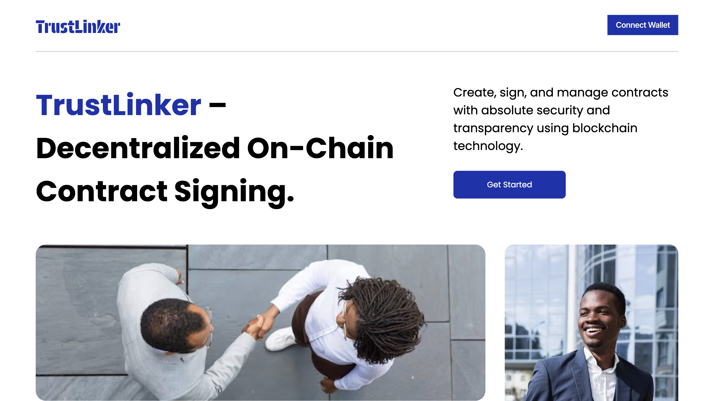

## Trustlinker

Trustlinker is a decentralized agreement signing application designed to remove the need for traditional third-party intermediaries in agreements between two or more parties. Using blockchain technology, Trustlinker ensures tamper-proof, transparent agreements that protect all parties involved, without relying on centralized authorities.

## Key Features

- Decentralized: Agreements are stored securely on the blockchain, eliminating the need for trust in any single party.
- Tamper-Proof: Agreements, once signed, cannot be altered, ensuring integrity and immutability.
- AI-Powered Contract Generation: Trustlinker leverages the Web3.js library along with the OpenAI plugin to automatically generate smart contracts, ensuring accuracy and reliability that goes beyond typical AI contract generation.
- Transparent: All terms are visible and verifiable by all parties.
- User-Friendly: A straightforward interface for drafting, signing, and managing agreements on-chain.

## Screenshots

- Screenshot 1

- Screenshot 2

## How AI Aids Tamper-Proof Contracts

Trustlinker integrates Web3.js and an AI-driven contract generator powered by the OpenAI plugin. This combination ensures that the smart contracts generated are compliant with blockchain standards and are securely stored on-chain. Unlike traditional AI-generated contracts, this method ensures the contracts are self-executing and tamper-resistant, leveraging blockchain’s decentralized nature to protect users from potential alterations or breaches of agreement terms.

## Use Cases

- Business contracts between companies or individuals.
- Personal agreements such as loans, rentals, or service agreements.
- Multi-party contracts, ensuring all signatories fulfill their obligations.

## How It Works

- Draft the Agreement: Use AI to generate a smart contract through Web3.js and OpenAI integration.
- Sign the Agreement: Each party signs the contract using their blockchain wallet (private keys).
- Blockchain Storage: The contract is stored immutably on-chain, guaranteeing no further modifications can be made.
- Enforcement: Trustlinker ensures that the terms of the contract are upheld, with any breaches recorded on the blockchain.

### contractAddress: 0x53700f45Eb399e9E2640CC06899DdB41CDB94A89
### chain: optimisim sepolia
### blockexplorer: https://optimism-sepolia.blockscout.com/address/0x53700f45Eb399e9E2640CC06899DdB41CDB94A89
